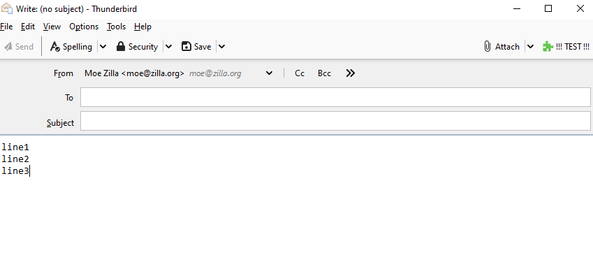
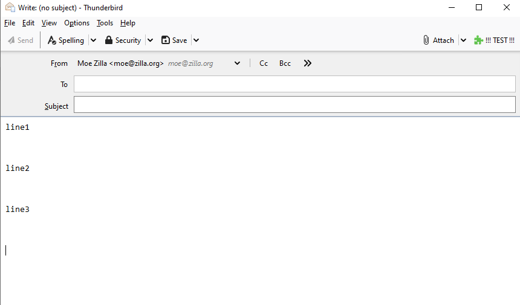
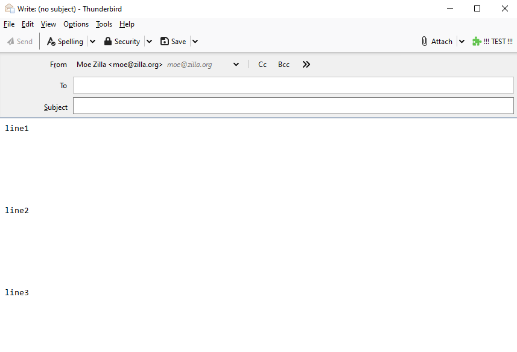

# Thunderbird MailExtension API - Bug in 'browser.compose.setComposeDetails'
> Tested with a fresh install of Thunderbird 78.3.3

## Note
This is a specific bug that only occurs when running Thunderbird on **WINDOWS**; Linux works fine.

It obviously has to do with the different "new line" handlings (`\r\n` vs `\n`) when working in **plain-text mode**.

## Code explanation
This sample extension contains nothing but this simple code:

```
browser.composeAction.onClicked.addListener(async (tab) => {
  let details = await browser.compose.getComposeDetails(tab.id);

  if (details.isPlainText) {
    let body = details.plainTextBody;
    console.log(body);
    browser.compose.setComposeDetails(tab.id, { plainTextBody: body });
  }
});
```

Here we read the plain-text body and send the **same unaltered content** back to the composer.

## Expected
Nothing happens to the composer body, since the content is being read and sent back without any changes.

## Actual
This **DOES** work without flaws under **Linux**.

However, on Windows the `\r\n`-sequences in the mail body - which get returned from `details.plainTextBody` - will be interpreted as `\n\n` when put back via `browser.compose.setComposeDetails`.

Result: The line-feeds get doubled with every click.

## How to reproduce
- install Thunderbird 78.3.3 on **Windows**
- install this example as a "temporary add-on"
- open a composer in **plain-text mode**
- type a few lines
- click the extension-button ("!!! TEST !!!") a few times 







