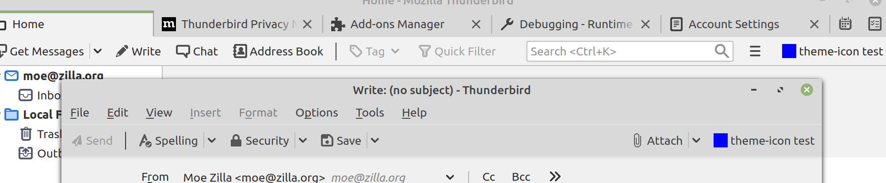
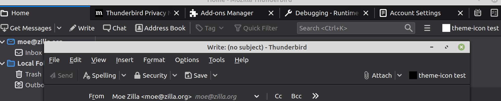
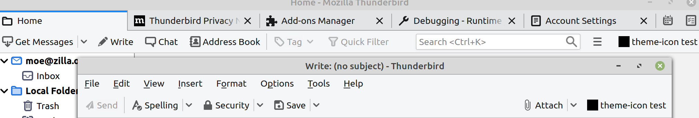

# Thunderbird Add-Ons - "Theme Icons" not working in compose window
> Tested with a fresh install of Thunderbird 78.3.2

## NOTE:
There is both a "browser action" _AND_ a "compose action" in this minimalistic demo!

The browser action will be shown in the main window's toolbar... the compose action in the composer's toolbar.

Both have a **blue** default icon and dedicated theme icons (**black**, **white**).

```
  "browser_action": {
    "default_title": "theme-icon test",
    "default_icon": "blue.png",
    "theme_icons": [
      {
        "dark": "black.png",
        "light": "white.png",
        "size": 32
      }
    ]
  },
  "compose_action": {
    "default_title": "theme-icon test",
    "default_icon": "blue.png",
    "theme_icons": [
      {
        "dark": "black.png",
        "light": "white.png",
        "size": 32
      }
    ]
  }
```

So... depending on the selected theme, the icons (main window / compose window) **SHOULD** have the same color.

This is what we actually have:

## Default Theme
### Expected
Both icons are **blue**.
### Actual

- Main Window: Correct. :heavy_check_mark:
- Compose Window: Correct. :heavy_check_mark:

## Dark Theme (TB built-in)

### Expected
Both icons are **white**.
### Actual
- Main window: Correct. :heavy_check_mark:
- Compose window: Wrong! :x: (shows the **black** one instead)

## Light Theme (TB built-in)

### Expected
Both icons are **black**.
### Actual
- Main window: Correct. :heavy_check_mark:
- Compose window: Correct. :heavy_check_mark:

## The gist
There seems to be a bug with the theme-handling in Thunderbirds compose-window toolbar.

Hope this example helps to fix the issue.
